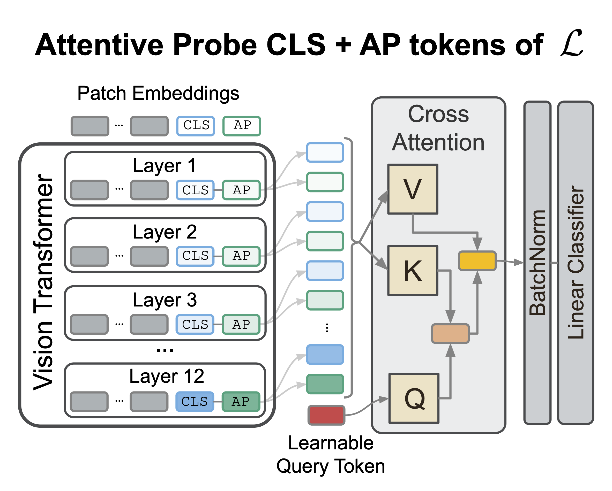

# Beyond the Final Layer: Attentive Multi-Layer Fusion for Vision Transformers

<div align="center">
  
</div>

This repository contains the code for the preprint paper "Beyond the Final Layer: Attentive Multi-Layer Fusion for Vision Transformers" [arXiv:XXXX.XXXXX](https://arxiv.org/abs/XXXX.XXXXX)

## Table of Contents

- [Repository Structure](#repository-structure)
- [Environment Setup and Setup of the Project](#environment-setup-and-setup-of-the-project)
- [Downloading the Datasets from Hugging Face](#downloading-the-datasets-from-hugging-face)
- [Running Experiments and Reproducing the Plots](#running-experiments-and-reproducing-the-plots)
- [Acknowledgments](#acknowledgments)
- [Citation](#citation)

## Repository Structure

```
├── src/                   # Core source code
│   ├── data/              # Dataset handling and loading
│   ├── models/            # ThingsVision wrappers for feature extraction
│   ├── tasks/             # Experiment tasks (linear and attentive probes, hyperparameter tuning)
│   ├── eval/              # Evaluation metrics
│   └── utils/             # Utility functions
├── scripts/               # Experiment scripts and configurations
│   ├── configs/           # Configuration files for models and datasets
│   └── download_ds/       # Dataset download utilities
├── notebooks/             # Analysis and visualization notebooks
│   ├── main_section/     # Main paper figures
│   └── appendix_section/ # Appendix materials
└── data/                  # Static data files
```

**Note**: All experimental data (datasets, features, model checkpoints, results, etc.) is stored in the **project root directory** as described in [2. Project Structure](#2-project-structure).

## Environment Setup and Setup of the Project

### 1. Environment Setup

> [!NOTE]
> Experiments were conducted on a SLURM cluster with Apptainer. Instructions below are tailored for this setup.

We provide pre-built containers with all dependencies:
- **Docker**: `docker://ghcr.io/lciernik/attentive-layer-fusion:latest`
- **Apptainer**: `oras://ghcr.io/lciernik/attentive-layer-fusion:latest-sif`

### 2. Project Structure

Configure your project root directory in [scripts/project_location.py](scripts/project_location.py):

```
[PROJECT_ROOT]/
├── datasets/              # Downloaded datasets
├── features/              # Extracted features
├── models/                # Trained probe models
├── model_similarities/    # Model similarity matrices
└── results/               # Experimental results
```

Build the directory structure: `python scripts/project_location.py`

## Downloading the Datasets from Hugging Face

All the datasets used in the experiments have been downloaded from the [CLIP Benchmark](https://huggingface.co/datasets/clip-benchmark) repository on Hugging Face. The script `scripts/download_ds/download_datasets.sh` downloads the datasets.

Ensure to use `[BASE_PATH_PROJECT]/datasets` as the target directory. Please follow the instructions in the [README](scripts/download_ds/README.md) to download the datasets.

## Running Experiments and Reproducing the Plots

> [!TIP]
> If you only want to reproduce the visualizations of the experiments, use the pre-aggregated results in <code>data/results/aggregated/</code> and run the notebooks in <code>notebooks/main_section</code>.

### Before You Start (on a SLURM Cluster with Apptainer)

- Connect to a compute node, via `srun`: `srun --partition=cpu-5h --mem=64G --pty bash`
- Run an interactive shell in the container: `apptainer run --nv --writable-tmpfs -B [BASE_PATH_PROJECT] [CONTAINER_PATH] /bin/bash`
- Navigate to the repository root directory: `cd $PATH_TO_REPO`
- Run any task (below)

### Running Different Tasks

To run any task, you must be in the container and in the repository root directory, i.e., at `PATH_TO_REPO`.

- **Feature extraction**: All datasets (entire dataset) `python scripts/feature_extraction.py`

- **Model evaluation**:
  - Single layer evaluation
    - All datasets on last layer: `python scripts/single_model_evaluation.py`
    - On appendix datasets and all layers: `python scripts/single_model_evaluation_all_intermediate_layers.py`
  - Linear probe (multi-layer) 
    - on pre-extracted features: `python scripts/combined_models_evaluation_linear_probe_large_experiments.py`
  - Attentive probe (multi-layer or all tokens last layer) 
    - on pre-extracted features: `python scripts/combined_models_evaluation_attn_probe_large_experiments.py`
    - end-to-end: `python scripts/end_2_end_eval_attentive_probe_frozen_backbone.py`
  - Fine-tuning (classic with linear classification head on top)
    - end-to-end: `python scripts/- end-to-end: `python scripts/end_2_end_eval_linear_probe_finetuning.py`.py`
  - Representationals similarity computation: `python scripts/distance_matrix_computation_all_layers.py`

> [!TIP]
> Run experiments on a single machine using commands in the `job_cmd` variable within each script.

> [!NOTE]
> The indicated scripts are to reproduce our main experiments. These can be used as a template to run e.g., end-to-end multi-layer attentive probe training on a single dataset for a specific model by modifying the respective script.


### Visualizations

Before you can start reproducing the visualizations, you need to have the results of the experiments and aggregate them.

- **Aggregating the results**:
  - Run notebook `notebooks/aggregate_results.ipynb` to aggregate the results.
  - Or use the pre-aggregated results in <code>data/results/aggregated/</code>.
- **Visualizing the results**:
  - Run the notebooks in `notebooks/main_section` to visualize the results.

## Related Work
This project builds upon or uses heavily the following repositories and works:
- [ThingsVision](https://github.com/ViCCo-Group/thingsvision) for feature extraction and end-to-end model evaluation
- [similarity_consistency](https://github.com/lciernik/similarity_consistency) repository

## Citation

If you find this work interesting or useful in your research, please cite our paper:

```
```

### Thank you

If you have any feedback, questions, or ideas, please feel free to raise an issue in this repository. 
Alternatively, you can reach out to us directly via email for more in-depth discussions or suggestions. 

📧 Contact us: ciernik[at]tu-berlin.de or m.morik[at]tu-berlin.de

Thank you for your interest and support!
